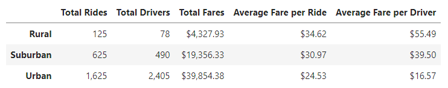
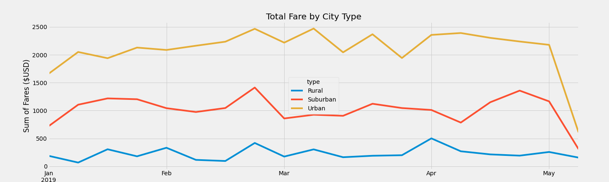

# PyBer_Analysis

## Overview
Data from January to May 2019 of a ride-sharing company was analyzed. Using Pandas and Matplotlib libraries, the data was used to generate a summary DataFrame by city type as well as a multi-line graph showing the total weekly fares by city type. A report on the disparities is also included with recommendations to decision-makers at PyBer. 

## Resources
Data sources: 
* [city_data.csv](Resources/city_data.csv)
* [ride_data.csv](Resources/ride_data.csv)

Software:
* Python 3.7.10
* Matplotlib 3.3.4
* Jupyter Notebook
* Anaconda
* Visual Studio Code 1.62.3

# Results
 

    
Summary DataFrame

     
  

The high-level summary shows some intuitive correlations. Urban cities generated/yielded the highest total fares with suburban and rural cities, trailing behind in that order. Certainly, this rban cities contracted the most total drivers, which makes sense as urban cities tend to be denser in cars and people than other city types. foremost in urban cities then suburban with rural cities 

 

    
Total Weekly Fare by City Type

     
  

There is a description of the differences in ride-sharing data among the different city types. Ride-sharing data include the total rides, total drivers, total fares, average fare per ride and driver, and total fare by city type. (7 pt)
Summary:

There is a statement summarizing three business recommendations to the CEO for addressing any disparities among the city types. (4 pt)
