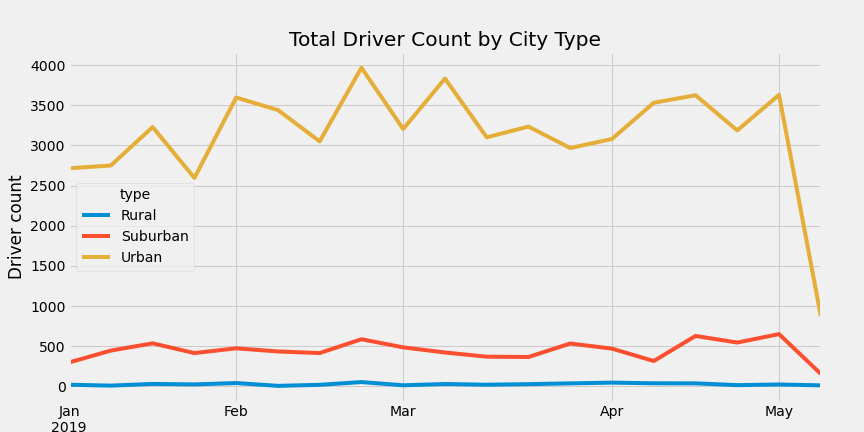

# PyBer_Analysis

## Overview
Data from January to May 2019 of a ride-sharing company was analyzed. Using Pandas and Matplotlib libraries, the data was used to generate a summary DataFrame by city type as well as a multi-line graph showing the total weekly fares by city type. A report on the disparities is also included with recommendations to decision-makers at PyBer. 

## Resources
Data sources: 
* [city_data.csv](Resources/city_data.csv)
* [ride_data.csv](Resources/ride_data.csv)

Software:
* Python 3.7.10
* Matplotlib 3.3.4
* Jupyter Notebook
* Anaconda
* Visual Studio Code 1.62.3

# Results
 

    
Summary DataFrame

     
  

Some interesting observations from the summary DataFrame are highlighted below. 
* Urban cities generated the highest total fares among the other city types with suburban and rural cities trailing behind in that order. 
* Total number of drivers for each city type are higher in denser city types. Urban cities have the highest number of total drivers with 2,405 contracted drivers with suburban and rural cities seeing 480 and 78 drivers, respectively. 
* There is an increase in the total number of rides, from rural to suburban to urban cities, however the increase is not proportional to the total drivers per city type. For example, in rural cities, there were 78 total drivers and 125 total rides, yielding an average of 1.60 rides per driver, whereas urban cities saw 0.68 and 1.28 rides for suburban cities. 
* As the supply of available drivers decreased in sparser city types, average fares increased, affecting both the average fare per ride and average fare per driver metrics.  

 

    
Total Weekly Fare by City Type

     
  

The comparison of total weekly fares by city type over time corroborates the total fares trend for each city type, as seen in the summary DataFrame. For example, urban cities consistently generate highest total fares throughout the January-May period followed by suburban and rural cities, respectively. Generally speaking across city types, weekly fares were relatively stable. Looking closer fares fluctuate slightly, it increases at the beginning of each month before slowing down as the next month approaches. However, there isn't an obvious peak or low season, except for in early May, where all 3 city types experienced a decline in total fares. Interestingly, the decline in total fares affected urban cities more severely than suburban and similarly suburban more than rural cities. The rideshare model relies on drivers to charge fare, so the observation that the total number of drivers is a major contributing factor to total fares seems logical. So, was there a similar decline in total drivers in early May?

 

    
Total Weekly Driver Count by City Type

     
  

The total active drivers per city type was also determined for the same time period as Total Weekly Fare analysis. Indeed, total driver counts also experienced the rapid decline in early May 2019, with urban cities suffering from a much steeper loss in drivers than the other city types. 

These declines did coincide with several events including IPOs of competing rideshare companies, Uber and Lyft, as well as strikes held by rideshare drivers who demanded for better working conditions, benefits and wages among other things. Regardless of the reason for the decline of total drivers in May, it is clear that any initiatives to address disparities in total fares across city types is dependent on the total driver count to, ideally, increase but at the very least remaining stable. 

# Summary
Based on these analyses, there are a few points to consider moving forward.
* The ridesharing model relies on drivers to remain contracted, avoid practices that could potentially reduce the pool of available drivers. Ideally, generate incentives to ensure driver satisfaction and retain contracts.
* Generate more incentive for customers to use PyBer services in urban cities. A ride:driver average of 0.6 in urban cities indicates drivers are not having as many opportunities to complete rides.  
* Generate more incentive for drivers to complete rides in rural cities. In contrast to urban cities, an average of 1.60 rides per driver indicates rural cities are underserviced.
 
